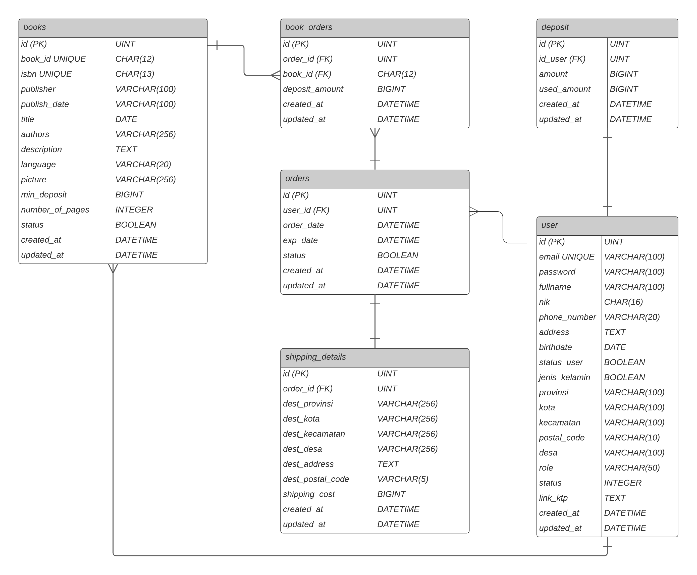
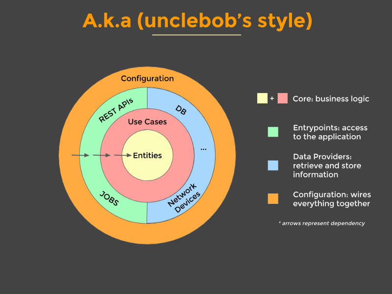

<div align="center">
    
    
    
    
</div>

### Table of Contents

| [Ruang Lingkup Pengembangan](#ruang-lingkup-pengembangan) | [Entity Relationship Diagram](#entity-relationship-diagram) | [Architectural Patterm](#architectural-pattern) | [Unit Testing](#unit-testing) | [API Postman Docs](#api-postman-docs) | [Swagger OpenAPI Docs](#swagger-openapi-docs) |
| :-------------------------------------------------------: | :---------------------------------------------------------: | :---------------------------------------------: | :---------------------------: | ------------------------------------- | --------------------------------------------- |

## Ruang Lingkup Pengembangan

[`^ kembali ke atas ^`](#table-of-contents)

**Hardware :**

```
- AMD Ryzen 5 2500u
- RAM 4GB DDR4
- AMD Radeon Vega Graphics
- 1TB HDD 128GB SSD
```

**Software :**

```
- MySQL + GORM
- Echo Go
- Docker
- Postman
- Swagger
- Visual Studio Code
```

**Lainnya :**

```
- Waktu pengerjaan +-3 minggu
```

## Entity Relationship Diagram

[`^ kembali ke atas ^`](#table-of-contents)



## Architectural Pattern

[`^ kembali ke atas ^`](#table-of-contents)



## Unit Testing

[`^ kembali ke atas ^`](#)

Hasil dari unit test yang telah dilakukan menunjukkan rerata nilai coverage yang berada di atas 80% pada tiap domain bisnis yang ada (6 domain bisnis).

```
ok  	Pinjem/businesses/book_orders	(cached)	coverage: 81.2% of statements
?   	Pinjem/businesses/book_orders/mocks	[no test files]
ok  	Pinjem/businesses/books	(cached)	coverage: 100.0% of statements
?   	Pinjem/businesses/books/mocks	[no test files]
ok  	Pinjem/businesses/deposits	(cached)	coverage: 81.2% of statements
?   	Pinjem/businesses/deposits/mocks	[no test files]
ok  	Pinjem/businesses/orders	(cached)	coverage: 84.2% of statements
?   	Pinjem/businesses/orders/mocks	[no test files]
ok  	Pinjem/businesses/shipping_details	(cached)	coverage: 100.0% of statements
?   	Pinjem/businesses/shipping_details/mocks	[no test files]
ok  	Pinjem/businesses/users	(cached)	coverage: 94.1% of statements
?   	Pinjem/businesses/users/mocks	[no test files]
```

## API Postman Docs

[`^ kembali ke atas ^`](#table-of-contents)

https://documenter.getpostman.com/view/14458184/UUy4e66j

## Swagger OpenAPI Docs

[`^ kembali ke atas ^`](#table-of-contents)

https://app.swaggerhub.com/apis/sultanfariz/Pinjem/1.0.0
