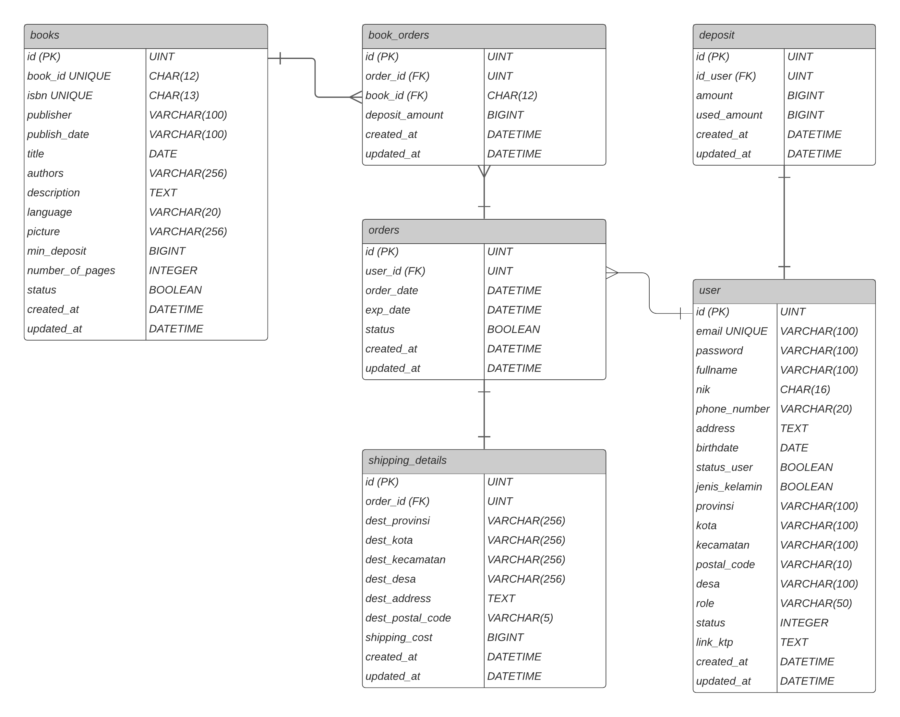

<div align="center">
    
    
    
    
</div>

| [Ruang Lingkup Pengembangan](#ruang-lingkup-pengembangan) | [Entity Relationship Diagram](#entity-relationship-diagram) | [Architectural Patterm](#architectural-pattern) | [API Postman Docs](#api-postman-docs) |
| :-------------------------------------------------------: | :---------------------------------------------------------: | :---------------------------------------------: | :-----------------------------------: |

## Ruang Lingkup Pengembangan

**Hardware :**

```
- AMD Ryzen 5 2500u
- RAM 4GB DDR4
- AMD Radeon Vega Graphics
- 1000TB 128SSD
```

**Software :**

```
- MySQL
- Echo Go
- Docker
- Visual Studio Code
```

**Lainnya :**

```
- Waktu pengerjaan +-3 minggu
```

## Entity Relationship Diagram



## Architectural Pattern

## API Postman Docs

https://documenter.getpostman.com/view/14458184/UUy4e66j
